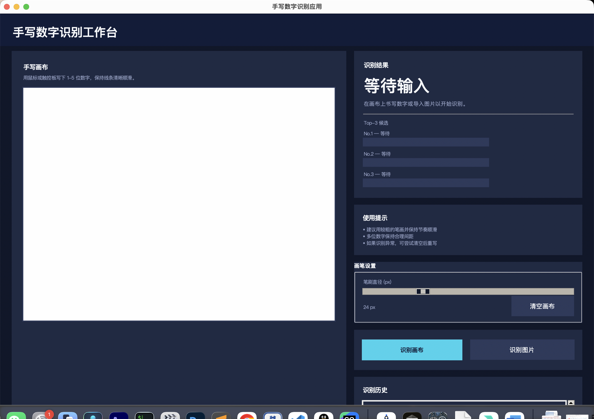

# 手写数字识别应用

一个面向教学/展示的桌面端手写数字识别 Demo。基于 PyTorch 训练轻量 CNN，配套 Tkinter 深色系 GUI，可在 640×480 画布上实时手写多位数字并查看 Top‑3 置信度。



## 功能亮点

- **MNIST 轻量 CNN**：3 段卷积 + MLP 分类头，准确率优于传统 MLP；训练脚本支持数据增强、验证集挑选、学习率调度与 TorchScript 导出。
- **智能画布**：离屏绘制 + 平滑笔刷，支持 1~5 位数字书写、画布放大与笔刷粗细调节。
- **多数字切分**：自适应阈值 + 形态学 + 连通域合并，结合 TTA 平滑预测。
- **结果面板**：展示最终预测、Top‑3 条形图、识别历史与状态反馈，便于课堂演示。
- **可选公式识别扩展**：`formula_recognizer.py` 接入 pix2tex，后续可加入到 GUI。

## 目录结构

```
handwritten_digit_app/
├── app_gui.py             # Tkinter 界面
├── train_model.py         # PyTorch 训练 / 导出脚本
├── formula_recognizer.py  # pix2tex 封装（可选）
├── docs/
│   ├── design_report.md   # 设计报告（按题目要求）
│   └── screenshots/
│       └── ui_preview.png
├── requirements.txt
├── run_app.sh
├── README.md
└── ...（训练产物、模型文件等已在 .gitignore 中忽略）
```

## 快速开始

```bash
git clone https://github.com/<your-account>/handwritten_digit_app.git
cd handwritten_digit_app
python3 -m venv .venv && source .venv/bin/activate
pip install -r requirements.txt
```

### 训练模型

```bash
python train_model.py --epochs 20 --batch-size 192 --hidden-dim 128
```

脚本会自动下载 MNIST、构建数据增强、训练并在 `artifacts/` 下写入：

- `model_scripted.pt`（GUI 默认加载）
- `model_state.pt`
- `training_history.json`
- `training_curves.png`

常用参数：`--device cuda`、`--val-split 0.12`、`--no-plot`、`--save-plot some/path.png` 等。

### 运行 GUI

```bash
python app_gui.py
```

或使用脚本：

```bash
./run_app.sh            # 默认直接启动 GUI
./run_app.sh --train-only
./run_app.sh --force-train
```

界面操作要点：

- 在左侧画布书写 1~5 位数字，使用右侧“画笔设置”调整笔刷。
- 点击“识别画布”获得预测结果；“识别图片”支持导入 PNG/JPG/BMP。
- Top‑3 条形图与识别历史可快速查看模型置信度与最近结果。

## 常见问题

- **GUI 显示 1244 等误判**：请确认使用最新训练的 `model_scripted.pt`，或重新运行训练脚本。
- **缺少 pix2tex 依赖**：仅在使用 `formula_recognizer.py` 时需要，可按照文件内提示安装。
- **数据/模型过大**：`data/`、`artifacts/`、`model_*.pt` 等均已加入 `.gitignore`，不会上传到 GitHub，可按需重新生成。

## 许可证

此项目仅供学习和课程设计使用，如需二次发布请注明来源。